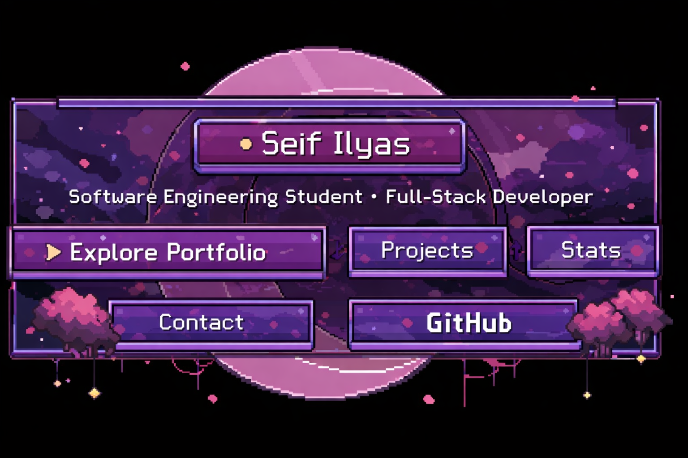

<p align="center">
  
</p>

<p align="center">

<a href="#about">

</a>

<a href="#projects">

</a>

<a href="#stats">

</a>

<a href="#contact">

</a>

</p>

---

<a id="about"></a>

##  About Me

```yaml
name: Seif Ilyas
role: Software Engineering Student
focus:
  - Full Stack Development
  - Web Applications
  - Real World Projects
  - Software Engineering
currently:
  - building real world projects
  - improving technical skills
  - creating polished developer projects
```

---

##  Tech Stack

<p align="center">


</p>

---

<a id="projects"></a>

##  Projects

- **HireSpace**  
  Job advertisement portal with employer dashboards, job listings and applications.

- **AI Stream Highlight Generator**  
  Uses AI to detect highlight moments from long gaming streams automatically.

- **BD25 Crowd Engagement System**  
  Machine learning driven audience interaction platform for live events.

---

<a id="stats"></a>

##  GitHub Stats

<p align="center">


</p>

<p align="center">


</p>

---

##  Contribution Graph

<p align="center">


</p>

---

<a id="contact"></a>

##  Connect

<p align="center">

<a href="https://github.com/seifilyas">

</a>

<a href="https://www.linkedin.com/in/seifilyas/">

</a>

</p>

---

<p align="center">


</p>
